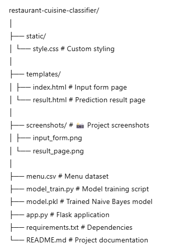
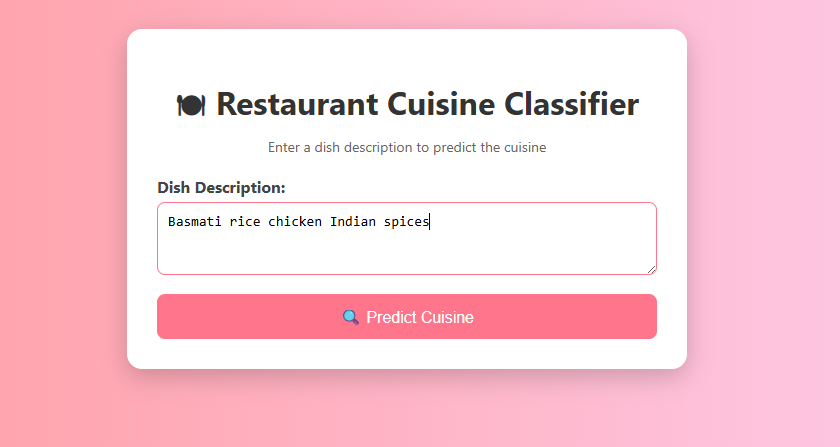
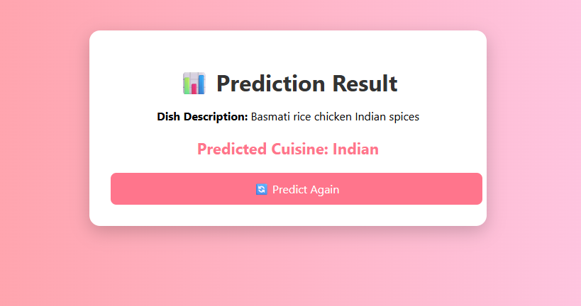

# 🍽 Restaurant Cuisine Classifier (Naive Bayes)

A **Flask-based Machine Learning web application** that predicts whether a dish belongs to **Italian, Indian, or Chinese cuisine** based on its description.  
The classification is powered by a **Naive Bayes** model trained on menu descriptions.

---

## 🔍 Overview
This project allows users to enter a dish description and instantly see the predicted cuisine type.  
It uses **text vectorization** and **Naive Bayes** to classify menu items into one of three cuisines:
- 🍕 **Italian**
- 🍛 **Indian**
- 🥡 **Chinese**

---

## ✨ Features
- 📌 Predicts cuisine type from menu descriptions
- 🤖 Uses **Multinomial Naive Bayes** for text classification
- 📂 Dataset in CSV format for easy updates
- 🖥 Responsive **HTML/CSS frontend**
- ⚡ Flask-powered real-time prediction

---

## 🛠 Tech Stack
- **Python 3.10+**
- **Flask**
- **scikit-learn**
- **pandas**
- **HTML/CSS**

---

## 📂 Project Structure

---

## ⚙ Installation & Setup

## 1️⃣ Clone the Repository
git clone https://github.com/yourusername/restaurant-cuisine-classifier.git
cd restaurant-cuisine-classifier

## 2️⃣ Install Dependencies

pip install -r requirements.txt

## 3️⃣ Train the Model

python model_train.py
This will create model.pkl.

## 4️⃣ Run the Web App

python app.py
Open in your browser:

http://127.0.0.1:5000/

## 📸 Screenshots
🖥 Input Form

📊 Prediction Result

## 💡 Use Cases
📱 Restaurant menu categorization

📊 Food delivery app search optimization

🎓 Machine Learning text classification demonstration

## 📌 Future Enhancements
Expand dataset with more cuisines

Use TF-IDF vectorization for better accuracy

Deploy online via Heroku or Render